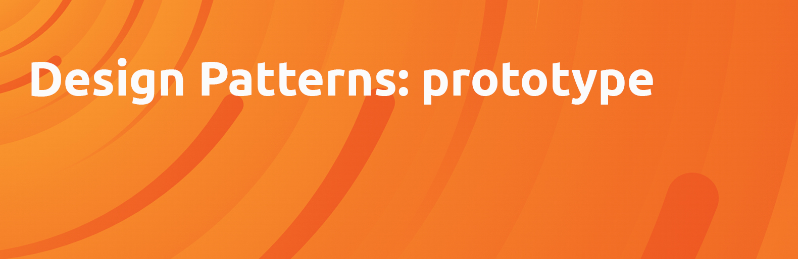

# Prototype

The Prototype pattern allows you to create objects that inherit properties and methods from a prototype object. 

## benefits

1. Consistent Interface
2. Customization and Variation
3. Dynamic Object Generation
4. Encourages Design Flexibility
5. Enhanced Performance
6. Facilitates Prototyping
7. Object Creation Efficiency
8. Object Isolation
9. Reduced Code Duplication
10. Simplifies Testing

## Use cases of a Prototype

Here are some instances where a prototype class finds practical application:

1. 3D Printing and Manufacturing
2. Caching and Resource Management
3. Configuration and Settings
4. Database Records and ORM
5. Document Generation
6. Game Development
7. Graphic Design and UI Frameworks
8. Localization and Internationalization
9. Networking and Data Serialization
10. Simulation and Modeling

## Code

### Javascript

```javascript
class Prototype {
    clone() {
        return Object.assign(Object.create(Object.getPrototypeOf(this)), this);
    }
}

class Person extends Prototype {
    constructor(name, age) {
        super();
        this.name = name;
        this.age = age;
    }
    
    display() {
        console.log(`Name: ${this.name}, Age: ${this.age}`);
    }
}

// Creating prototypes
const Jenifer = new Person("Jenifer", 55);
const Jake = new Person("Jake", 50);

// Cloning prototypes
const Jenifer_clone = Jenifer.clone();
const Jake_clone = Jake.clone();

// Displaying cloned objects
Jenifer_clone.display();
Jake_clone.display();
```

### Python

```python
import copy

class Prototype:
    def clone(self):
        return copy.deepcopy(self)

class Person(Prototype):
    def __init__(self, name, age):
        self.name = name
        self.age = age
    
    def display(self):
        print(f"Name: {self.name}, Age: {self.age}")

# Creating prototypes
Jenifer = Person("Jenifer", 55)
Jake = Person("Jake", 50)

# Cloning prototypes
Jenifer_clone = Jenifer.clone()
Jake_clone = Jake.clone()

# Displaying cloned objects
Jenifer_clone.display()
Jake_clone.display()
```
