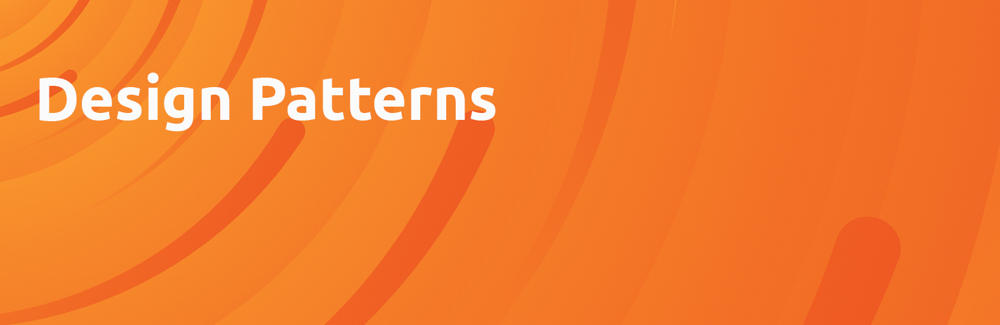

# Design Patterns | Python | Javascript

Design patterns are reusable solutions to common problems that arise in software design. They provide a way to approach software development that emphasizes best practices, proven solutions, and modularity. Design patterns help developers create code that is more consistent, easier to understand, and easier to maintain over time. They are not specific to any particular programming language or technology and can be applied in a variety of contexts. Using design patterns can improve the quality, reliability, and maintainability of software, but they should be used judiciously to avoid unnecessary complexity.

## Why use design patterns?

Design patterns are used in software development for a variety of reasons, including:

* **Reusability**

  Design patterns provide reusable solutions to common problems, allowing developers to save time and effort by not having to reinvent the wheel each time a similar problem arises.

* **Modularity**

  Design patterns can help break down complex systems into smaller, more manageable pieces, making it easier to develop, test, and maintain the software.

* **Extensibility**

  Design patterns can make it easier to extend the functionality of a software system without having to modify the existing code, improving the overall flexibility and adaptability of the system.

* **Maintainability**

  By following established design patterns, developers can create code that is more consistent, easier to understand, and easier to maintain over time.

* **Scalability**

  Design patterns can help ensure that a software system can handle increasing amounts of data or traffic without becoming overly complex or difficult to manage.

## Type of Design Patterns

### 1. Creational

|  | Link |
|:--|:-:|
| Abstract Factory | |
| Builder | |
| Factory Method |                              |
| Prototype      | [Read](/Creational/Prototype) |
| Singleton      | [Read](/Creational/Singleton) |

### 2. Structural

|           | Link |
| --------- | :--: |
| Adapter   |      |
| Bridge    |      |
| Composite |      |
| Decorator |      |
| Facade    |      |
| Flyweight |      |
| Proxy     |      |

### 3. Behavioral

|                         | Link |
| ----------------------- | :--: |
| Chain of Responsibility |      |
| Command                 |      |
| Iterator                |      |
| Mediator                |      |
| Memento                 |      |
| Observer                |      |
| State                   |      |
| Strategy                |      |
| Template Method         |      |
| Visitor                 |      |

